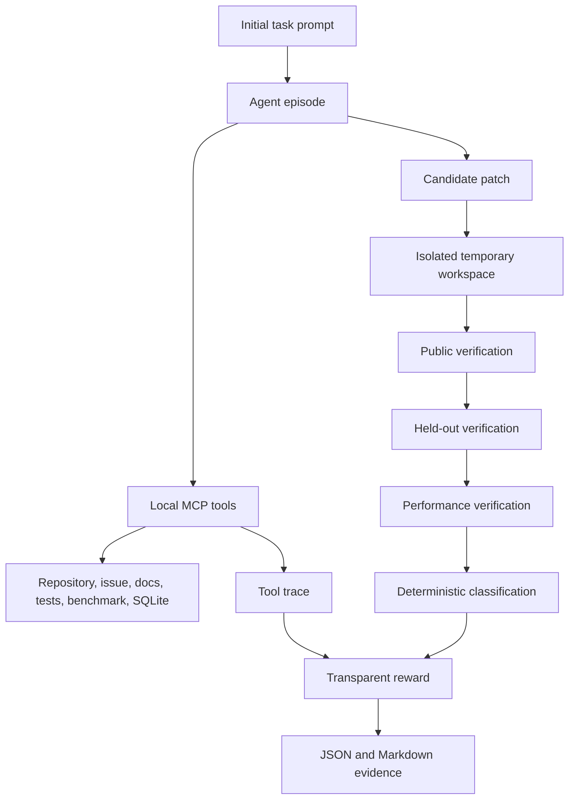
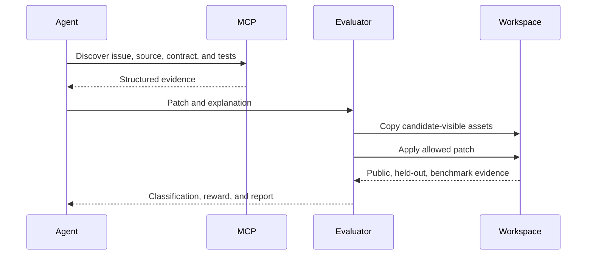
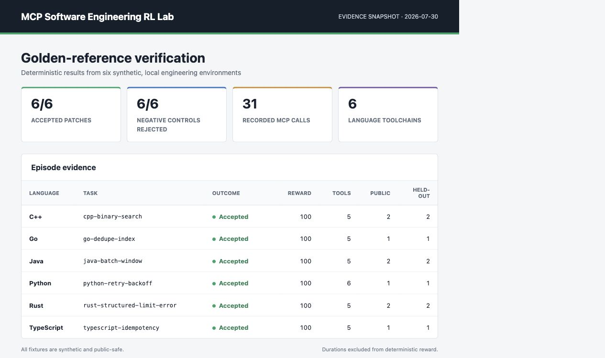

# MCP Software Engineering RL Lab

Reproducible, local reinforcement-learning-style environments for evaluating how an AI coding agent **discovers requirements through Model Context Protocol tools, changes an unfamiliar repository, and proves the result**. Six original synthetic tasks cover Python, Java, Rust, Go, TypeScript, and C++.

> **Portfolio disclosure:** This is an independently designed public proof-of-work project. All codebases, issues, documentation, traces, and benchmark fixtures are synthetic and public-safe. It is not a private benchmark, customer system, or claim of model-vendor endorsement.

## Thirty-second overview

| What it demonstrates | Implementation |
| --- | --- |
| MCP-based codebase discovery | Six official MCPServer local servers plus a deterministic in-process transport |
| Reproducible coding-agent tasks | Baseline, public tests, held-out tests, golden patch, and negative control per task |
| Evidence-oriented evaluation | Ordered tool trace, changed files, process output, classification, and reward |
| Cross-language engineering | Python 3.11+, Java, Rust 2024, Go, Node TypeScript, and C++20 |
| Defensive execution controls | Bounded paths, patch allowlist, filtered environment, timeouts, and output caps |
| Honest performance work | Deterministic complexity gate plus genuine Go benchmark output |

## Why this exists

A final patch cannot show whether an agent understood the issue, found the relevant contract, used tools correctly, preserved behavior, or merely overfit a visible test. This lab makes the full episode reviewable. It mirrors the engineering needed to author coding-agent environments and golden references while remaining small enough to run locally without paid services.

## Architecture



The official [Model Context Protocol Python SDK](https://github.com/modelcontextprotocol/python-sdk) powers the standalone stdio servers. Default tests use the same tool handlers in process for deterministic execution.

## Task catalogue

| Task | Language | Engineering work | Hidden contract | Negative control |
| --- | --- | --- | --- | --- |
| `python-retry-backoff` | Python | Complex bug fix | First attempt uses base delay | Linear backoff |
| `java-batch-window` | Java | Feature implementation | Exact-capacity fills are valid | Off-by-one remains |
| `rust-structured-limit-error` | Rust | Behavior-preserving refactor | Error variants and display text | Collapsed error cases |
| `go-dedupe-index` | Go | Performance optimization | Stable first-seen order | Sorted map output |
| `typescript-idempotency` | TypeScript | Reliability fix | Per-key, not global, coalescing | Global in-flight promise |
| `cpp-binary-search` | C++ | Algorithmic correction | Half-open interval and absent value | Insertion index returned |

Every package includes the initial prompt, engineering context, MCP-discoverable facts, acceptance criteria, resource limits, public and held-out tests, a minimal golden patch, explanation, expected trace, and one intentionally wrong patch.

## Episode lifecycle

1. Load and schema-validate `task.yaml`.
2. Expose only bounded local facts through MCP tools.
3. Record the ordered tool trace and structured results.
4. Build a temporary candidate workspace with baseline code and public tests only.
5. Reject malformed patches, traversal, and prohibited files before applying changes.
6. Run public tests, overlay held-out tests internally, then run benchmarks.
7. Classify the result and calculate an inspectable reward.
8. Write canonical `episode.json` and reviewer-ready `episode-report.md`.



## MCP tool-trace example

```json
{
  "server": "documentation",
  "tool": "search_docs",
  "arguments": {"query": "backoff"},
  "result": {"ok": true, "content": {"matches": []}}
}
```

Traces are validated by [`schemas/tool_trace.schema.json`](schemas/tool_trace.schema.json). A technically correct patch can still receive `incorrect_tool_use` or `missing_evidence` when its recorded episode omits required discovery evidence.

## Golden-patch method

Golden patches are minimal calibration references, not the only acceptable implementation. Each is tested against both public and evaluator-only held-out tests. A plausible wrong patch must fail, which guards against weak task design.

```bash
python scripts/verify_golden_patches.py
```

See [`docs/golden_solution_methodology.md`](docs/golden_solution_methodology.md) for the authoring method and [`golden_patches/`](golden_patches/) for the language index.

## Deterministic classifications

`accepted`, `compile_error`, `runtime_error`, `test_failure`, `hidden_test_failure`, `contract_violation`, `performance_regression`, `incorrect_tool_use`, `missing_evidence`, `incomplete_task`, and `malformed_patch`.

Correctness dominates scoring: patch correctness plus public and held-out tests carry 60% by default. Tool discovery, evidence, maintainability, performance, and explanation are reported separately rather than blended into a hidden judge.

## Quick start

Prerequisites are Python 3.11+, Git, and compatible language toolchains for the full six-task check.

```bash
python3 -m venv .venv
source .venv/bin/activate
python -m pip install pip==26.2.1
python -m pip install -e '.[dev]'
python -m mcp_rl_lab catalogue
python scripts/validate_task_packages.py
python scripts/run_episode.py tasks/bug_fixing/python-retry-backoff --golden --output reports/generated/python-retry
```

Run all quality gates:

```bash
make verify
```

Verify one candidate patch:

```bash
mcp-rl-lab verify tasks/bug_fixing/python-retry-backoff tasks/bug_fixing/python-retry-backoff/golden/solution.patch
```

Resolve and record toolchains:

```bash
python scripts/build_environments.py
```

## Docker smoke test

The image runs the Python evaluator catalogue with no network, a read-only root filesystem, and a temporary `/tmp`:

```bash
docker compose build
docker compose up --abort-on-container-exit --exit-code-from lab
```

Docker smoke status is recorded honestly in [`TEST_REPORT.md`](TEST_REPORT.md); the language compilers remain host quality gates.

## Genuine evidence snapshot



The screenshot is generated from the six canonical files under [`reports/episodes/`](reports/episodes/), not from hand-entered dashboard values. The corresponding calibration run accepted all six golden patches and rejected all six negative controls with `hidden_test_failure`.

```text
python-retry-backoff: golden=accepted, negative=hidden_test_failure
java-batch-window: golden=accepted, negative=hidden_test_failure
rust-structured-limit-error: golden=accepted, negative=hidden_test_failure
go-dedupe-index: golden=accepted, negative=hidden_test_failure
typescript-idempotency: golden=accepted, negative=hidden_test_failure
cpp-binary-search: golden=accepted, negative=hidden_test_failure
```

## Repository map

```text
mcp_servers/       six local MCP servers and shared bounded tool registry
src/mcp_rl_lab/    orchestration, isolation, patching, verification, reward, reports
environments/      language and toolchain descriptors
tasks/             six complete synthetic engineering task packages
golden_patches/    cross-language reference index
fixtures/          issue, documentation, SQLite, and trace context
schemas/           seven JSON Schema contracts
scripts/           build, validate, compare, benchmark, report, and scan commands
tests/             evaluator, security, tool, schema, and toolchain coverage
reports/           genuine generated episode and benchmark evidence
docs/              architecture, task design, security, and recruiter walkthroughs
```

## Security boundary

The lab validates paths and executables, filters environment variables, limits patch and output size, applies timeouts, and uses disposable candidate workspaces. **It is not a hardened production sandbox.** Allowlisted compilers and runtimes still execute with the current user's OS permissions. Use a disposable VM or purpose-built isolation service for unknown code.

## Testing strategy

- Unit tests for models, traces, path rules, rewards, and structured errors
- Integration tests for local MCP tools and temporary workspaces
- Real toolchain tests for all six golden patches
- Negative tests confirming every intentionally wrong patch fails
- Schema validation for manifests, environments, traces, episodes, rewards, and verifier output
- Secret scanning and Ruff formatting/lint checks
- Genuine Go benchmark command with a deterministic operation-count gate

Actual commands, counts, and limitations are in [`TEST_REPORT.md`](TEST_REPORT.md).

## Role relevance

This repository is designed as evidence for software-engineering specialist, coding-agent evaluator, AI tutor, and RL-environment authoring work. It demonstrates task decomposition, unfamiliar-codebase analysis, cross-language testing, golden-reference construction, deterministic grading, tool-use evaluation, performance reasoning, and reviewer-facing technical documentation.

## Limitations

The task codebases are intentionally compact and synthetic. The default client tests tool semantics in process rather than measuring stdio latency. Host toolchains affect build availability, while durations never affect deterministic reward. See [`docs/limitations.md`](docs/limitations.md) for the full list.

## Recruiter walkthrough

Start with one manifest, compare its golden and incorrect patches, then inspect a generated episode report. The focused path is documented in [`docs/recruiter_walkthrough.md`](docs/recruiter_walkthrough.md).

## License and safety

Apache-2.0 licensed. Use only on repositories and patches you are authorized to evaluate. No real credentials, private code, or confidential evaluation data are included. Read [`SAFETY.md`](SAFETY.md) before running candidate code.

## Actual stdio MCP task calibration

The isolated [protocol bench](docs/protocol-bench/README.md) adds four synthetic Python coding tasks,
two real official-SDK stdio servers, behavioral reference/alternative/negative controls, and seven
per-attempt evidence artifacts. It preserves the existing six-language catalog and commands.
`python -m pytest tests/protocol_bench` verifies real protocol calls and task acceptance. The runner
is explicitly no-key scripted calibration; it does not claim live model performance or hostile-code
containment. See the linked guide for requirements, safety boundaries and reproduction commands.
