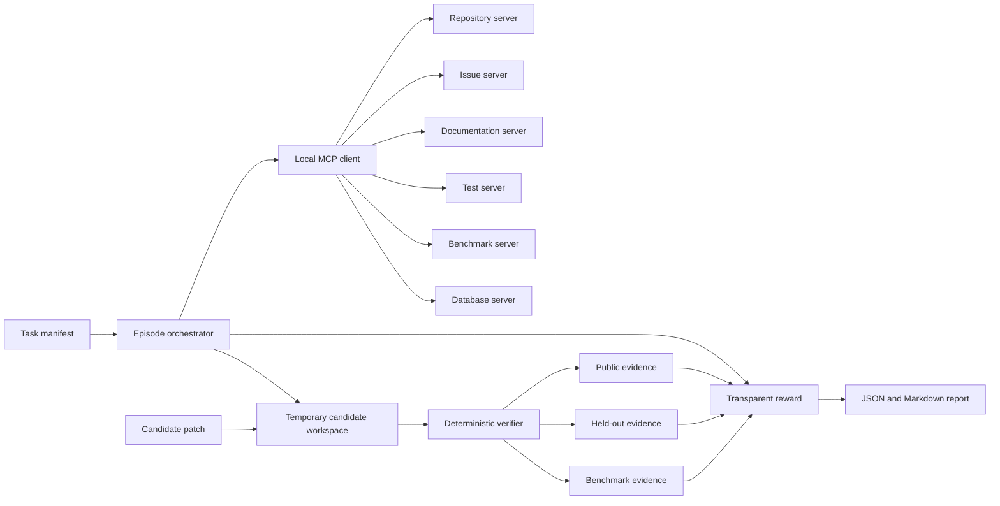

# Architecture

## Evaluation problem

Coding-agent evaluation needs more than a final diff. This lab captures how an agent discovers hidden requirements through local MCP tools, what it changes, and whether public, held-out, regression, and performance checks support the result.

## Trust boundaries

The task author can see baselines, held-out tests, golden patches, and evaluator internals. A candidate workspace receives only baseline files and public tests. Held-out tests are copied into the evaluator-owned temporary workspace only after the patch passes public checks.

The process runner filters environment variables, validates executable names, caps output, and applies timeouts. These are useful local controls, not OS-level isolation. Run unknown patches in an external container or virtual machine.

## Data flow

1. `TaskManifest` validates the task package.
2. `LocalToolRegistry` exposes bounded task facts through structured tools.
3. `TraceRecorder` records calls, arguments, results, order, and duration.
4. `CandidateWorkspace` copies candidate-visible assets into a temporary Git repository.
5. `patch_applier` checks diff paths and allowed-change patterns before `git apply`.
6. `verifier` runs public tests, overlays held-out tests, then runs optional benchmarks.
7. `reward` computes independent components and keeps correctness dominant.
8. `report` writes one canonical JSON episode and a reviewer-readable Markdown view.

## Module boundaries

| Module | Responsibility | Deliberately excludes |
| --- | --- | --- |
| `mcp_servers/` | Tool contracts and local MCP transports | Patch scoring |
| `workspace_manager.py` | Candidate-visible filesystem construction | Command execution |
| `process.py` | Bounded subprocess evidence | Task policy |
| `verifier.py` | Verification sequence and classification | Subjective style judging |
| `reward.py` | Transparent weighted score | Hidden heuristics |
| `report.py` | JSON and Markdown presentation | Mutating evaluation results |

See [DEC-001 in the decisions log](../DECISIONS.md) for why the deterministic registry and official MCP transports coexist.
