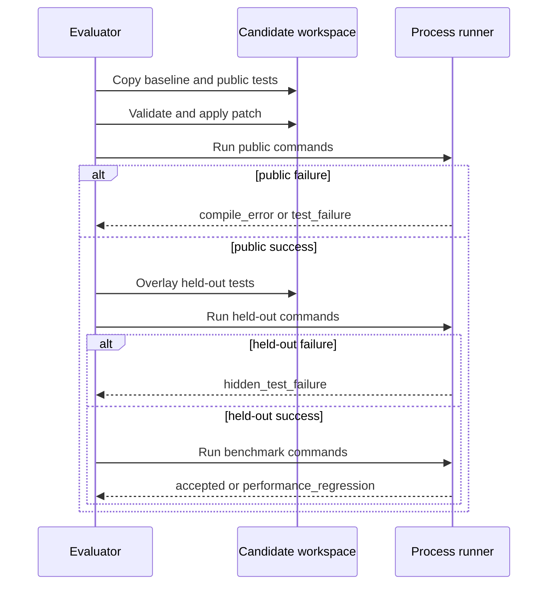

# Deterministic Verification

## Classification order

Patch parsing and allowed-file checks run first. Build/test commands stop at the first failure in each phase. Compiler command failures become `compile_error`; public execution failures become `test_failure`; evaluator-only test failures become `hidden_test_failure`; benchmark command failures become `performance_regression`.

`incorrect_tool_use` and `missing_evidence` are episode-level outcomes applied only after a technically accepted patch if required discovery calls are absent or failed.

## Reproducibility

Fixtures do not use network services, random seeds, wall-clock assertions, or external data. Reports include commands, exit codes, output, duration, changed files, and the candidate-exclusion check. Durations are evidence but are not part of the episode identity or deterministic reward.
